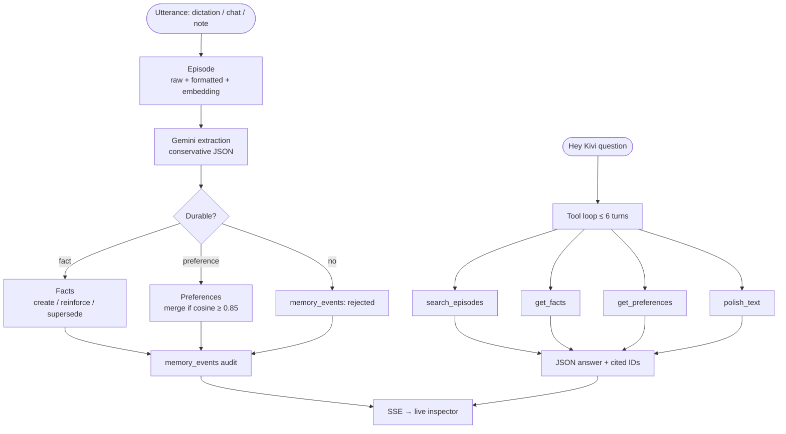

# Kivi (Semantic-memory layer) 🥝

**Semantic memory for a voice assistant that cites its sources — or stays quiet.**

Dictation → durable facts & preferences → Hey Kivi answers you can inspect, correct, and trust.

The runnable app lives in **[`kivi-memory/`](kivi-memory/)**. Same README is there with in-folder paths.

[Watch the Demo](https://youtu.be/zk7cpzY6mDo) · [Open the live UI](http://127.0.0.1:8000/) · [API docs](http://127.0.0.1:8000/docs) · [Positioning Statement](https://github.com/vir123-devf/KIVI_SEMANTIC_MEMORY/blob/main/positioning-statement.md)· [Product vision](https://github.com/vir123-devf/KIVI_SEMANTIC_MEMORY/blob/main/product-vision.md)


---

<details>
<summary><strong>Table of Contents</strong></summary>

1. [The Product](#the-product)
   * [Built With](#built-with)
2. [Demo video](#demo-video)
3. [Use Cases](#use-cases)
4. [Architecture](#architecture)
   * [Pipeline overview](#pipeline-overview)
   * [Stage-by-stage breakdown](#stage-by-stage-breakdown)
   * [Why these design choices](#why-these-design-choices)
5. [Getting Started](#getting-started)
   * [Prerequisites](#prerequisites)
   * [Installation](#installation)
6. [Usage](#usage)
7. [Results](#results)
8. [Repository Structure](#repository-structure)
9. [Limitations](#limitations)
10. [AI Use](#ai-use)
11. [Contributing](#contributing)
12. [License](#license)
13. [Contact](#contact)
14. [Acknowledgments](#acknowledgments)

</details>

---

## The Product

**Kivi** is a personal semantic-memory layer for **Hey Kivi**, a voice assistant used while dictating work. It is not a companion that infers identity. It is a **clerk**: it remembers what you already said, uses it only when you ask, and shows which memory produced the answer.

### What Kivi is allowed to know

| Kind | Example | Rule |
| --- | --- | --- |
| **Episode** | A Slack dictation at 17:02 | Append-only. Raw ASR + formatted text + embedding. Never edited by extraction. |
| **Fact** | `manager` → `Priya Nair` | Durable, checkable. Same subject + new value **supersedes** the old row. |
| **Preference** | “Sign off emails with Best, Vir” | Recurring style. Similar descriptions **reinforce** instead of duplicating. |

Ordinary dictation **writes** memory (episode + extraction). Hey Kivi is the only surface that **reads** facts and preferences. That boundary exists so Kivi does not restyle every capture in the background — styles and phonetics already own “make this utterance correct.”

### What the user can do

- Talk or paste a note; durable content is extracted immediately.
- Ask questions; answers must cite episode / fact / preference IDs from tools.
- Inspect, **edit**, and **reject** memories in a live panel (SSE).
- Trust contradiction handling: a later correction does not erase history.

### What the product refuses to become

A mood tracker, a relationship graph, a goal engine, or an org-wide brain. Those require assuming a mind. This product assumes **artifacts of speech** the user meant to keep.

<p align="right">(<a href="#kivi-">back to top</a>)</p>

### Built With

* [![Python][Python]][Python-url]
* [![FastAPI][FastAPI]][FastAPI-url]
* [![SQLAlchemy][SQLAlchemy]][SQLAlchemy-url]
* [![Gemini][Gemini]][Gemini-url]
* [![Postgres][Postgres]][Postgres-url]
* [![SQLite][SQLite]][SQLite-url]

<p align="right">(<a href="#kivi-">back to top</a>)</p>

---
## Demo video

Walkthrough of Hey Kivi, live memory, and fact updates:

**[Watch on YouTube](https://youtu.be/zk7cpzY6mDo)**

[](https://youtu.be/zk7cpzY6mDo)

---
## Use Cases

Scoped to three jobs that are useful without each other. If a feature does not serve one of these, it does not ship.

### 1. Episodic recall

**User:** “Find the dictation I did in Slack around 5pm yesterday.”

**Why it is hard:** that is a **filter** (time range + `source_app`) plus a **rank** (meaning). Pure vector search on the query string often returns a similar note from the wrong hour or app.

**What we built:** `search_episodes` applies structured filters first, then cosine-ranks embeddings inside the filtered set.

### 2. Fact grounding

**User:** “Who is my manager?” / “What’s our Q3 revenue target? I mentioned it more than once.”

**Why it is hard:** people correct themselves. Serving the first mention forever is wrong; deleting the first mention is also wrong.

**What we built:** facts keyed by `subject`. Same value → reinforce provenance. Different value → old row `superseded`, new row `active`. Hey Kivi reads **active** facts only and must cite `fact_id`s from `get_facts`. If nothing is stored (“What is my dog’s name?”), it **abstains**.

### 3. Preference-aware polish

**User:** “Find a Slack dictation and polish it for the meeting I’m walking into.”

**Why it is hard:** rewrite quality depends on *their* tone, not a generic professional voice.

**What we built:** `get_preferences` then `polish_text` with those descriptions as context. Preferences accumulate `evidence_count` when restated.

### Explicit non-goals

| Tempting idea | Why it is out |
| --- | --- |
| Sentiment / mood over time | Easy to get wrong; uncomfortable if wrong; unused by the three jobs |
| People / org graphs | Infers relationships the user did not name |
| Auto-apply style to every dictation | Breaks the dictation vs Hey Kivi boundary |
| Silent overwrite of facts | Destroys inspectability |

**Try in the UI**

| You type | You should see |
| --- | --- |
| `My manager is Priya Nair` | Live fact in the inspector |
| `Who is my manager?` | Cited answer |
| Edit value → **Update** | Old fact superseded; next answer uses the new value |
| `What is my dog's name?` | Honest “I don’t have that” |

<p align="right">(<a href="#kivi-">back to top</a>)</p>

---

## Architecture

Three tables, not one blob, because the lifecycles differ. Hybrid retrieval, not embeddings alone. Mandatory citations, so eval can score grounding without another LLM judge.

### Pipeline overview



**Write path:** `POST /ingest`, `POST /remember`, and `POST /hey-kivi` (user turn captured first) all create an episode, embed, extract, upsert, commit, then `publish` an SSE event.

**Read path:** Hey Kivi may call tools; the model’s final message must be JSON `{ answer, episode_ids, fact_ids, preference_ids }`. IDs that never appeared in the tool trace fail the eval grounding check.

### Stage-by-stage breakdown

| # | Stage | Module | What happens | Tech |
| - | ----- | ------ | ------------ | ---- |
| 1 | **Capture** | `app/main.py` | Persist episode from chat, note, or batch ingest. | FastAPI |
| 2 | **Embed** | `app/embeddings.py` | 768-d vector for later rank. | `gemini-embedding-001` |
| 3 | **Extract** | `app/extraction.py` | Summary + 0–2 durable candidates. Under-extract on purpose. | `gemini-3.6-flash` |
| 4 | **Fact upsert** | `upsert_fact` | Subject match → create, reinforce, or supersede. | SQLAlchemy |
| 5 | **Preference merge** | `upsert_preference` | Category + cosine ≥ 0.85 → `evidence_count++`. | NumPy cosine |
| 6 | **Audit** | `MemoryEvent` | Created / reinforced / superseded / rejected. | DB log |
| 7 | **Agent** | `app/agent.py`, `app/tools.py` | Function-calling loop; cite or abstain. | Gemini tools |
| 8 | **Live UI** | `frontend/index.html`, `app/realtime.py` | Edit/reject; EventSource refresh. | SSE |

### Why these design choices

| Choice | Reason |
| --- | --- |
| Three tables | Episodes, facts, and preferences do not share a lifecycle. One `memories` table would hide that in every reader. |
| Filter then rank | “5pm in Slack” is structured. Vectors do not encode clocks or app names reliably. |
| Supersede, don’t overwrite | You can see *when the system’s belief changed*. Required for “how memory is stored, changed, and removed.” |
| Forced JSON citations | Makes “which memory?” and “did it invent an ID?” mechanical in `eval/run_eval.py`. |
| SQLite fallback | The API still runs on Windows without Docker; Postgres + pgvector remains the scale path. |

Stack: FastAPI, SQLAlchemy, Alembic, Gemini, Postgres/pgvector or SQLite, vanilla JS UI at `/`.

<p align="right">(<a href="#kivi-">back to top</a>)</p>

---
## Getting Started

### Prerequisites

* Python 3.11+ (verified on 3.14)
* Gemini API key
* Optional Docker for Postgres + pgvector

### Installation

```powershell
cd kivi-memory
python -m venv venv
.\venv\Scripts\python.exe -m pip install -r requirements.txt
copy .env.example .env
```

```
GEMINI_API_KEY=your_key_here
EXTRACTION_MODEL=gemini-3.6-flash
AGENT_MODEL=gemini-3.6-flash
EMBEDDING_MODEL=gemini-embedding-001
EMBEDDING_DIM=768
```

If PowerShell blocks `Activate.ps1`, do not activate — call `.\venv\Scripts\python.exe` directly.

```bash
docker compose up -d && alembic upgrade head   # optional
```

<p align="right">(<a href="#kivi-">back to top</a>)</p>

---
## Usage

```powershell
cd kivi-memory
.\venv\Scripts\python.exe -m uvicorn app.main:app --reload --port 8000
```

Open **http://127.0.0.1:8000/** — header should read **live**.

1. Chat a durable fact → inspector updates without reload.
2. Ask it back → cited IDs under the answer.
3. **Update** / **Remove** in Live memory → supersede or `rejected_by_user`.
4. **Remember a note** for extraction without the agent.

```powershell
.\venv\Scripts\python.exe -m corpus.generate_corpus
.\venv\Scripts\python.exe -m corpus.ingest --file corpus/data/records.json
```

<p align="right">(<a href="#kivi-">back to top</a>)</p>

---

## Results

What has actually been run — not a claimed leaderboard score.

| Check | How | Outcome |
| --- | --- | --- |
| Unit + API tests | `python -m pytest tests -q` | **9 passing** — cosine identity/orthogonal/opposite; fact create → reinforce → supersede; preference merge; `/health` + `/ingest` + `PATCH` fact |
| Live Gemini smoke | Ingest 3 notes, `POST /hey-kivi` “Who is my manager?” | Extracted **Priya Nair** and **Project Falcon**. Answer: “Your manager is Priya Nair.” `cited_fact_ids` matched `get_facts` |
| Contradiction (by design) | Q3 `$2.4M` then `$2.6M` | Active fact is `$2.6M`; earlier row remains `superseded` |
| Abstention (by design) | Eval q7 dog’s name, q8 invented Series B | Must not invent; scored in harness |
| Live inspector | SSE `GET /events/{user_id}` | Create/edit/remove refresh the panel immediately |

**Eval harness** (`eval/questions.json`, 9 items) after a full ingest:

```powershell
python -m eval.run_eval --user-id <uuid>
```

Writes `eval/results.json` with per-question answer, full tool trace, citation IDs, latency, and:

- **grounded** — every cited ID appeared in the tool trace  
- **keyword_match** — Priya, Falcon, 9:30, 2.6, Best Vir, direct  
- **correctly_abstained** — for no-answer items  
- **passed** / **pass_rate** / **avg_latency_ms**

This README does not invent a pass rate the harness has not written. After you run eval, quote those numbers in a review.

<p align="right">(<a href="#kivi-">back to top</a>)</p>

---

## Repository Structure

```
kivi-memory/
├── app/
│   ├── main.py           # ingest, remember, hey-kivi, fact PATCH, SSE
│   ├── extraction.py     # Gemini extract + upsert
│   ├── embeddings.py
│   ├── retrieval.py      # hybrid search
│   ├── agent.py          # tool loop
│   ├── tools.py          # four tools
│   ├── realtime.py       # SSE broker
│   └── llm.py            # Gemini client
├── frontend/index.html   # live chat + inspector
├── corpus/               # generate + ingest ~500 records
├── eval/                 # questions + scoring
├── tests/
├── migrations/
├── docs/                 # positioning + vision
└── docker-compose.yml
```

<p align="right">(<a href="#kivi-">back to top</a>)</p>

---

## Limitations

Honest constraints. Several of these are *load-bearing* (they follow the product position), not just “we ran out of time.”

| Limitation | Impact | Why it is this way / what next |
| --- | --- | --- |
| Preference merge at **0.85 cosine** | Near-paraphrases may duplicate or over-merge | Heuristic, not labeled; calibrate on real restatements |
| **No auth** — `user_id` is trusted | Anyone who knows an ID can read that memory | Fine for a take-home; not multi-tenant production |
| **`polish_text` is unverified** | Rewrite can drift from the source facts | Dedicated consistency check would be the next eval case |
| Chat extraction on **every user turn** | Questions can occasionally yield junk candidates | Prompt is conservative; still model-dependent |
| Session in **`localStorage`** | Clearing the browser starts a new user | No login by design for the demo |
| **SQLite** ranks embeddings in process | Fine at hundreds of rows; not 100k | Postgres + pgvector + IVFFlat when Docker is available |
| **Single provider (Gemini)** | Quota/outage hits extract, chat, and embed | Swap models via `.env`; architecture stays |
| **Synthetic corpus** | Eval keywords match planted persona, not messy ASR | Real dictation will need a higher abstention bar |
| IVFFlat `lists` | Recall degrades if the table stays tiny or grows huge | Retune with corpus size |
| No independent **hallucination judge** on free-text `answer` | Keyword + grounding is the mechanical bar | Human review still needed for polish quality |

<p align="right">(<a href="#kivi-">back to top</a>)</p>

---

## AI Use

### What AI was used for (Part Two — allowed)

Architecture discussion, schema and extraction/retrieval/agent code, live UI and SSE, migrations, corpus tooling, eval harness, and this README were produced **with generative-AI assistance** (Cursor + Gemini in the running product).

### Models in the running system

| Role | Model | Why |
| --- | --- | --- |
| Extraction + Hey Kivi + `polish_text` | `gemini-3.6-flash` | Structured JSON, native function calling, low latency |
| Embeddings | `gemini-embedding-001` | 768-d; used for episode/fact rank and preference merge |
| Local fallback embed | SHA-256–seeded Gaussian | Tests and keyless ingest still run |

Override `EXTRACTION_MODEL`, `AGENT_MODEL`, `EMBEDDING_MODEL` in `.env` with no code change.

<p align="right">(<a href="#kivi-">back to top</a>)</p>

---

## Contributing

1. Fork the project  
2. `git checkout -b feature/AmazingFeature`  
3. `git commit -m 'Add some AmazingFeature'`  
4. `git push origin feature/AmazingFeature`  
5. Open a Pull Request  

<p align="right">(<a href="#kivi-">back to top</a>)</p>

---
<!-- LICENSE -->
## License

Distributed under the MIT License. See `LICENSE.txt` for more information.

<p align="right">(<a href="#readme-top">back to top</a>)</p>


---

## Contact

<div align="center">

# Virendra Badgotya

**M.Tech — Data Science & Artificial Intelligence (DSAI)**
**Indian Institute of Technology Madras (IIT Madras)**

<a href="https://www.linkedin.com/in/virendra-badgotya-ai/">
  
</a>
&nbsp;
<a href="mailto:da26m027@smail.iitm.ac.in">
  
</a>

</div>

 


<p align="right">(<a href="#kivi-">back to top</a>)</p>

---

## Acknowledgments

* FastAPI · SQLAlchemy · Alembic · Google Gemini · pgvector  
* [Best-README-Template](https://github.com/othneildrew/Best-README-Template)  

<p align="right">(<a href="#kivi-">back to top</a>)</p>

[Python]: https://img.shields.io/badge/Python-3776AB?style=for-the-badge&logo=python&logoColor=white
[Python-url]: https://www.python.org/
[FastAPI]: https://img.shields.io/badge/FastAPI-009688?style=for-the-badge&logo=fastapi&logoColor=white
[FastAPI-url]: https://fastapi.tiangolo.com/
[SQLAlchemy]: https://img.shields.io/badge/SQLAlchemy-D71F00?style=for-the-badge&logo=sqlalchemy&logoColor=white
[SQLAlchemy-url]: https://www.sqlalchemy.org/
[Gemini]: https://img.shields.io/badge/Google%20Gemini-8E75B2?style=for-the-badge&logo=googlegemini&logoColor=white
[Gemini-url]: https://ai.google.dev/
[Postgres]: https://img.shields.io/badge/PostgreSQL-4169E1?style=for-the-badge&logo=postgresql&logoColor=white
[Postgres-url]: https://www.postgresql.org/
[SQLite]: https://img.shields.io/badge/SQLite-003B57?style=for-the-badge&logo=sqlite&logoColor=white
[SQLite-url]: https://www.sqlite.org/
